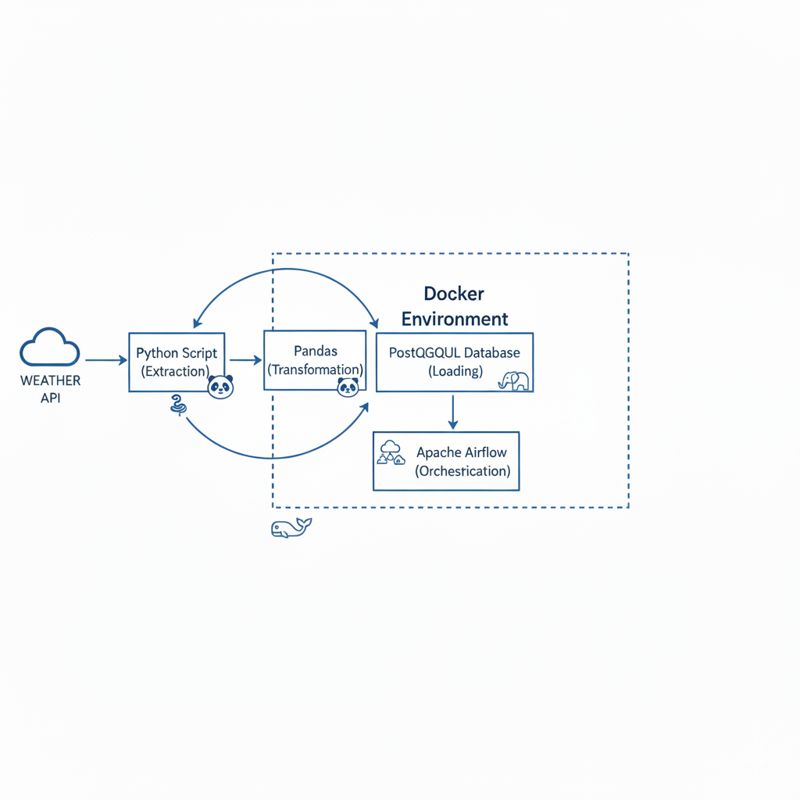

# 🌦️ Airflow Weather ETL Pipeline

An end-to-end **ETL pipeline** built using **Apache Airflow**, **PostgreSQL**, and **Docker**.  
The pipeline fetches live weather data from the Weatherstack API, cleans and validates it, and stores it in a PostgreSQL database for further analytics.

### 📊 ETL Pipeline Diagram

---

## 🚀 Features

✅ Automated data ingestion using Airflow  
✅ Data cleaning & validation in Python  
✅ Raw + cleaned data stored in PostgreSQL  
✅ Fully containerized with Docker  
✅ Idempotent inserts (no duplicate rows)  
✅ Organized project structure (ETL scripts + DAGs)  
✅ Environment variables for secrets (no API keys in repo)

---

## 🏗️ Architecture

Weather API → Extract (Python) → Clean → Load → PostgreSQL
│
↓
Apache Airflow (DAG)
---

## 📦 Tech Stack

| Component | Technology |
|-----------|------------|
| Workflow Orchestration | Apache Airflow |
| Database | PostgreSQL |
| Containerization | Docker & Docker Compose |
| Language | Python |
| API Source | Weatherstack API |

---

## 🧰 Project Structure
/
├─ airflow/
│ ├─ dags/
│ │ └─ orchestrator.py
├─ api_request/
│ ├─ api_request.py
│ ├─ insert_records.py
├─ postgres/
│ └─ init-airflow.sql
├─ docker-compose.yml
├─ .env.example
├─ README.md

---

## ⚙️ Setup & Run

### 1️⃣ Clone the repo
### 2️⃣ Create a .env file based on .env.example
Add your API key and DB credentials.
### 3️⃣ Start the project
docker-compose up -d
### 4️⃣ Open Airflow UI
http://localhost:8080
### 5️⃣ Trigger the DAG: weather_etl_dag
